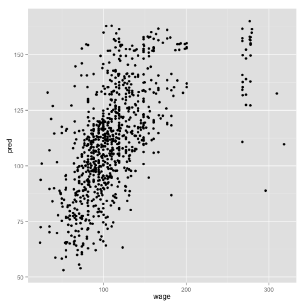

An App to Predict Wage
========================================================
author: 
date: 8/23/2015

What is the App
========================================================

To predict wage based on the following factors:

- age
- job class
- marital status
- education
- race
- health
- health insurance

To access the app: https://czhong.shinyapps.io/wage

The Data Used  
========================================================


```r
library(caret)
library(ISLR)
data(Wage)
wages<-subset(Wage,select=-c(sex,region,logwage))
inTrain<-createDataPartition(y=wages$wage,p=0.7,list=FALSE)
training<-wages[inTrain,]
testing<-wages[-inTrain,]
modFit<-train(wage~.,data=training,method="lm")
```

The Model
========================================================
- (Intercept):-2525.5373; year: 1.2918; age: 0.2824
- `Married`: 17.8303; `Widowed`: 3.8702
- `Divorced`: 4.0288; `Separated`: 12.7385
- `Black`: -7.6285; `Asian`: -4.9543
- `Other`: -9.0570; `HS Grad`: 6.8693 
- `Some College`: 17.9440; `College Grad`: 30.6645
- `Advanced Degree`: 53.3240; `Information`: 3.0153
- `health2. >=Very Good`: 7.2149; 
- `health_ins2. No`: -17.0747

Prediction With Testing Data 
========================================================


```r
pred<-predict(modFit,testing)
qplot(wage,pred,data=testing)
```

 
